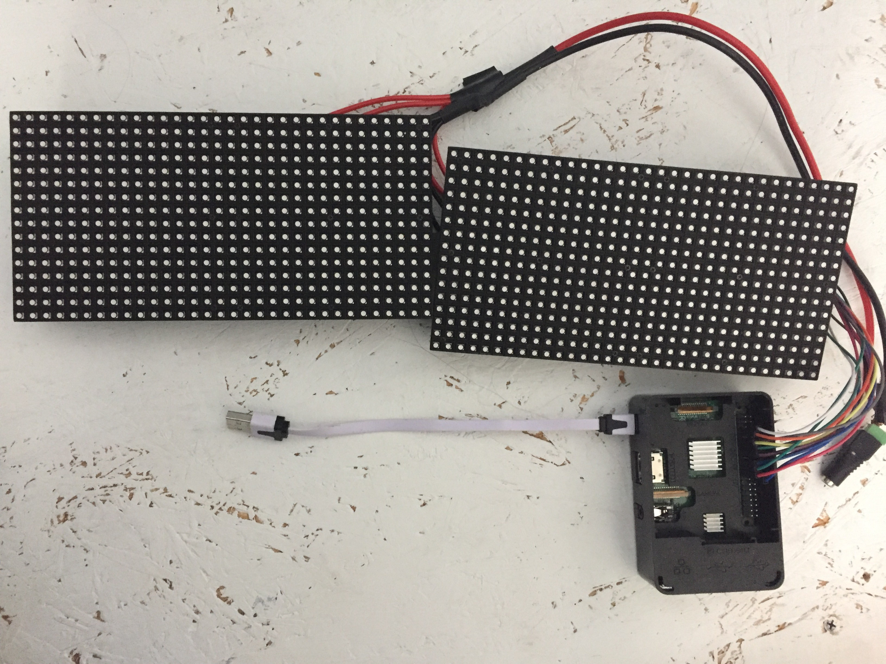
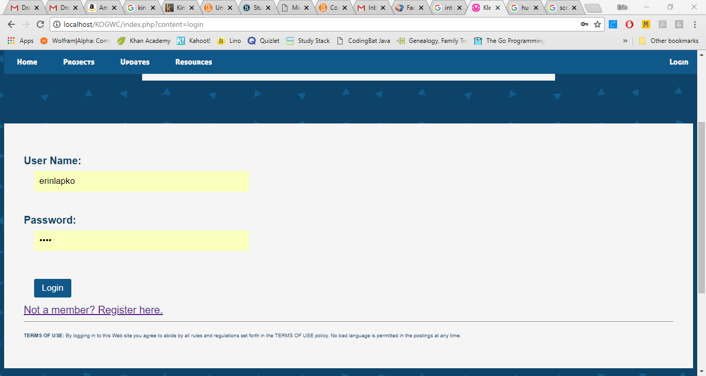

## Erin Lapko


### Projects

RSS Reader using Adafruit matrices and a Raspberry Pi 3, following the <a href="https://github.com/hzeller/rpi-rgb-led-matrix">Hzeller repository.</a>




Website for local Girls Who Code website, using PHP and MySQL.




Code in <a href="https://github.com/erinlapko/KO-GWC-Website">separate repository.</a>


###  Contact
```markdown
<a href="mailto:erinlapko@gmail.com?"Contac me</a>
```
