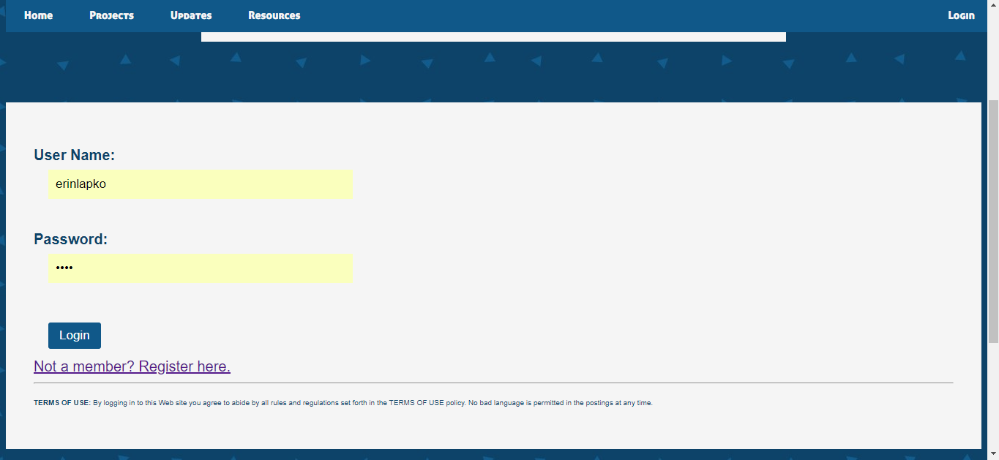

## Erin Lapko

### Projects

RSS Reader using Adafruit matrices and a Raspberry Pi 3, following the <a href="https://github.com/hzeller/rpi-rgb-led-matrix">Hzeller repository.</a>

 
 
Website for local Girls Who Code website, using PHP and MySQL.
The website has
  - login/logout PHP sessions
  - post and comment features
  

Code in <a href="https://github.com/erinlapko/KO-GWC-Website">separate repository.</a>

